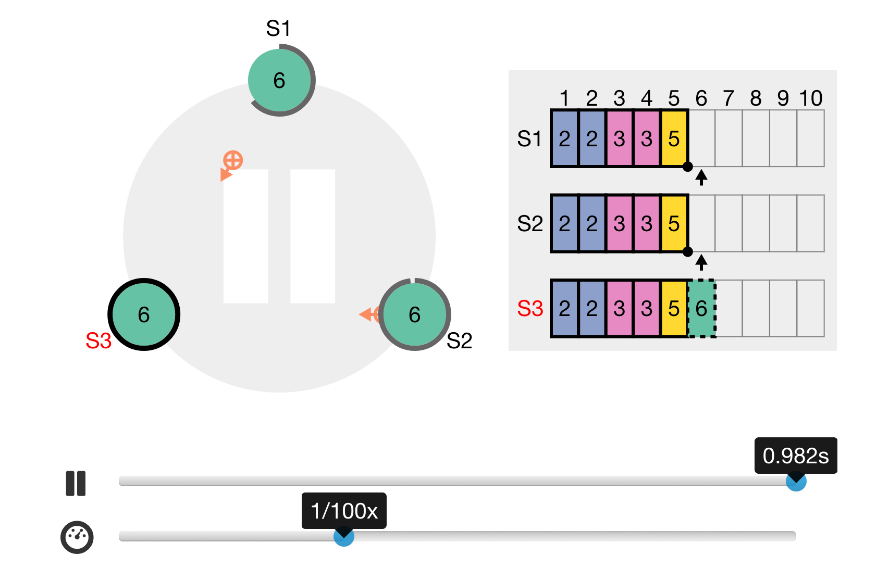

# TaraScope [(taraframework.github.io/tarascope/)](https://taraframework.github.io/tarascope/)

Tarascope is an extended version of [Raftscope](https://github.com/ongardie/raftscope) & [Runway Browser](https://github.com/salesforce/runway-browser) by Diego Ongaro (@ongardie).

TaraScope aides your understanding of TARA with a bunch of visualized edge cases.

[Try this model in Runway](https://runway.systems/?model=github.com/taraframework/runway-model-tara)

TaraScope may not cover all edge cases either due to lack of code. This specification of TARA is for visual purposes of understanding only & not a final specification; if there is such a thing, it's [TARA.tla](https://github.com/TARAFramework/tara.tla).
